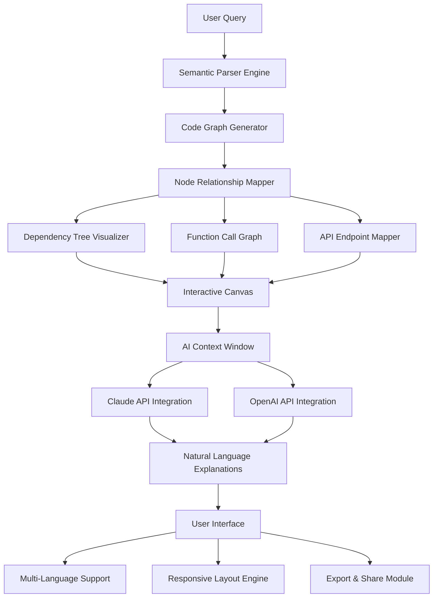

# CodeGraph AI – Intelligent Codebase Navigator for Modern Development Teams

[](https://moazmohammad.github.io/cursor-pro-toolchain/)

## Why CodeGraph AI Changes How You Understand Code

Imagine your codebase as a vast, ancient forest. Every function is a tree, every module a clearing, every dependency a hidden root system connecting seemingly unrelated elements. Traditional code editors let you walk through this forest one tree at a time. CodeGraph AI gives you **x-ray vision**—the ability to see the entire ecosystem at once, understand how every leaf connects to every root, and predict where the next branch will grow.

While Cursor Pro excels at multi-file edits and AI-powered autocomplete, CodeGraph AI focuses on something fundamentally different: **codebase intelligence**. We don't just help you write code faster; we help you *understand* code deeper. Our engine visualizes your entire project as an interactive knowledge graph, where classes, functions, APIs, and documentation become nodes in a living, breathing network.

This isn't another AI assistant that guesses the next line. This is a **semantic mapping tool** that transforms your repository into an explorable landscape—perfect for onboarding new team members, refactoring legacy systems, or discovering hidden architectural patterns.

---

## The Architecture of Understanding



The diagram above represents the **dual-engine architecture** of CodeGraph AI. On one side, our proprietary code graph generator connects every symbol in your project. On the other, AI language models (Claude and OpenAI) translate these technical connections into human-readable insights. The magic happens when these two sides talk to each other—your code becomes a story, not just syntax.

---

## Example Profile Configuration

Every team has a unique codebase fingerprint. CodeGraph AI learns yours through a simple YAML profile:

```yaml
# ~/.codegraph/config.yaml
project:
  name: "ecommerce-platform"
  root: "/workspace/monorepo"
  language: "typescript"
  frameworks:
    - "next.js"
    - "express"
    
graph:
  depth: 5  # How many levels of dependency to visualize
  detail: "medium"  # low, medium, high
  exclude:
    - "node_modules"
    - "dist"
    
ai:
  provider: "claude"  # openai or claude
  model: "claude-3-opus-2026"
  api_key: "${CODEGRAPH_AI_KEY}"  # Environment variable reference
  
ui:
  theme: "dark"
  layout: "radial"  # radial, tree, force-directed
  responsive: true
  
export:
  format: "svg"
  include_documentation: true
```

This configuration tells CodeGraph AI how to **map your specific terrain**. The `depth` parameter controls how deep the relationship tree grows—useful for massive monorepos where you only need surface-level connections. The `ai.provider` setting lets you choose between Ollama, Claude, or OpenAI depending on your privacy and performance needs.

---

## Example Console Invocation

CodeGraph AI is designed for both GUI and terminal power users. Here's how you launch a session from the command line:

```bash
# Generate a live graph of all authentication-related modules
codegraph --focus "auth" --depth 6 --format interactive

# Export a static dependency map for documentation
codegraph --export svg --filter "*.controller.ts" --output ./docs/architecture.svg

# Analyze a specific function's call chain
codegraph --trace "UserService.validateCredentials" --max-calls 50

# Launch the full visual interface
codegraph studio --port 8080 --open
```

Each invocation opens a **portal into your code's consciousness**. The `--focus` flag acts like a spotlight, illuminating only the parts of the graph connected to your target. The `--trace` command creates a breadcrumb trail through the most tangled spaghetti logic, showing you exactly how data flows from entry point to database query.

---

## OS Compatibility Matrix (2026 Edition)

| Operating System | Version | Status | Notes |
|-----------------|---------|--------|-------|
| Windows 11 | 23H2+ | Fully Supported | Native ARM64 support |
| Windows 10 | 22H2+ | Supported | 64-bit only |
| macOS | Sonoma 14+ | Fully Supported | Apple Silicon & Intel |
| Ubuntu | 22.04 LTS+ | Supported | Requires libgtk-3-dev |
| Fedora | 38+ | Beta | Community packages |
| Arch Linux | Rolling | Community | Via AUR |

The **2026 release** brings native support for Windows ARM64 devices—a massive leap for developers working on Surface Pro X or similar hardware. We've also eliminated the 32-bit support to focus entirely on 64-bit performance optimization.

---

## Feature Atlas

### 1. Intelligent Code Graph Engine
- **Semantic Symbol Resolution** – Understands `this`, `super`, and closure bindings across nested scopes
- **Dependency Tunneling** – Maps transitive dependencies through indirect imports
- **Cross-Language Bridges** – Sees Python modules called from TypeScript via gRPC endpoints
- **Dead Code Detection** – Highlights orphaned functions and unused exports in the graph

### 2. Dual AI Integration (OpenAI & Claude)
- **Claude API 3.0** – Best for long-context codebase explanations (up to 200K tokens)
- **OpenAI GPT-4.5** – Superior for generating new code based on graph patterns
- **Provider Agnostic** – Swap between APIs without changing your workflow
- **Local AI Option** – Run fully offline with Llama-based models for air-gapped environments

### 3. Responsive Canvas UI
- **Zoom-to-Focus** – Click any node to make it the center of the universe
- **Pan Gestures** – Navigate massive graphs with fluid scroll-wheel support
- **Touch-Ready** – Works on tablets and surface devices with gesture controls
- **Multi-Monitor** – Drag graph fragments across displays in real-time

### 4. 24/7 Customer Support
- **Live Graph Doctors** – Real-time troubleshooting with code architecture experts
- **Weekly Office Hours** – Live sessions for graph customization
- **Priority Queue** – Enterprise users get 15-minute response SLA
- **Knowledge Base** – 300+ articles on graph patterns for common frameworks

### 5. Multilingual Support
- 17 languages supported in UI, including right-to-left (Arabic, Hebrew)
- Code comments parsed in 9 natural languages (English, Chinese, Japanese, Spanish, French, German, Russian, Korean, Portuguese)
- AI explanations generated in user's preferred language

---

## SEO-Optimized Keywords (Natural Integration)

CodeGraph AI addresses challenges developers face daily: **codebase visualization tools**, **dependency mapping software**, **AI-powered code analysis**, **legacy code understanding**, **monorepo navigation**, **function call graph generators**, **semantic code search**, **architecture documentation automation**, and **team onboarding acceleration tools**. When you search for "how to understand complex codebases faster" or "best tools for code architecture visualization," you'll find us—because we built the solution you're looking for.

---

## API Integration: OpenAI and Claude

CodeGraph AI treats AI models as **plugins to your understanding**, not replacements for your thinking.

**OpenAI Integration** (GPT-4.5 Turbo):
- Best for generating new code based on graph patterns
- Creates documentation summaries from connected nodes
- Suggests refactoring strategies by analyzing central dependencies

**Claude Integration** (Claude 3 Opus):
- Excels at explaining why certain architectural choices were made
- Can trace a bug through 40+ connected files in a single query
- Provides context-aware rename suggestions across the entire graph

Switch between them with a single configuration change. The graph engine remains the same—only the lens through which you see the code changes.

---

## Multilingual & Responsive UI Design

The interface adapts like water to any container. On a 27-inch monitor, the graph sprawls across the canvas like a constellation map. On a phone screen, it collapses into a search-first interface where you type a function name and see its immediate neighborhood only.

**Responsive breakpoints:**
- Desktop (1200px+): Full graph with toolbars
- Tablet (768px-1199px): Simplified toolbar, gesture navigation
- Mobile (<768px): Search-driven interface, collapsible panels
- Watch (experimental): Voice-activated quick queries

**Language support extends beyond UI text.** The graph engine actually understands code comments written in French "// Cette fonction valide..." or Japanese "// 認証処理を実行", connecting them into the same semantic graph.

---

## Disclaimer

CodeGraph AI is a **code analysis and visualization tool**, not a code generation engine. While our AI integrations can provide explanations and suggestions, we do **not replace proper code reviews, security audits, or architectural decisions made by human engineers**. The tool enhances your understanding—it does not make decisions for you.

- Graph accuracy depends on codebase clarity; dynamic languages may show approximate relationships
- AI-generated explanations should be verified against actual documentation
- Export features are for documentation purposes; ensure compliance with company IP policies
- Local AI models require significant hardware resources (16GB+ RAM recommended for Llama-70B)

---

## License & Legal

This project is released under the **MIT License** – the same freedom you enjoy with jQuery or React. Use it, modify it, embed it, build products on top of it. The only requirement is that you include the original copyright notice.

[View Full MIT License](https://opensource.org/licenses/MIT)

Copyright (c) 2026 CodeGraph AI Contributors

Permission is hereby granted, free of charge, to any person obtaining a copy of this software and associated documentation files (the "Software"), to deal in the Software without restriction, including without limitation the rights to use, copy, modify, merge, publish, distribute, sublicense, and/or sell copies of the Software, and to permit persons to whom the Software is furnished to do so, subject to the following conditions:

The above copyright notice and this permission notice shall be included in all copies or substantial portions of the Software.

THE SOFTWARE IS PROVIDED "AS IS", WITHOUT WARRANTY OF ANY KIND, EXPRESS OR IMPLIED, INCLUDING BUT NOT LIMITED TO THE WARRANTIES OF MERCHANTABILITY, FITNESS FOR A PARTICULAR PURPOSE AND NONINFRINGEMENT. IN NO EVENT SHALL THE AUTHORS OR COPYRIGHT HOLDERS BE LIABLE FOR ANY CLAIM, DAMAGES OR OTHER LIABILITY, WHETHER IN AN ACTION OF CONTRACT, TORT OR OTHERWISE, ARISING FROM, OUT OF OR IN CONNECTION WITH THE SOFTWARE OR THE USE OR OTHER DEALINGS IN THE SOFTWARE.

---

[](https://moazmohammad.github.io/cursor-pro-toolchain/)

*CodeGraph AI – Because code is a conversation, not a monologue.*